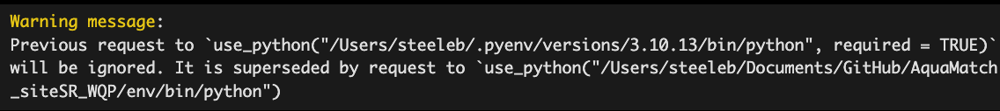

# Purpose

This is a helper script that loads all necessary packages to run the targets
pipeline, then runs it to acquire Landsat Collection 2 surface reflectance and
surface temperature for user-defined areas of interest (AOI). While this script
is written in an .Rmd script, we recommend walking through this script manually,
as the knit function often runs into issues and this script has a number of
interactive steps.

We have a user guide which describes all the steps in this (and the lakeSR)
workflow which [is available
here](https://aquasat.github.io/AquaMatch_lakeSR/index.html). We strongly
recommend reading through the user guide if you are using data that result from
this pipeline.

## Note

Landsat remote sensing images used in analyses courtesy of the United States
Geological Survey. Any use of trade, firm, or product names is for descriptive
purposes only and does not imply endorsement by the U.S. Government.

## Pre-requisites

siteSR relies on a configuration file (`config.yml`) to run specific profiles
that determine what operations are being run. The file contains two
configuration profiles: "default" and "admin_update".

-   "default" runs the pipeline using publicly-stable versions of datasets from
    a previously run pipeline. It requires a Google email address to complete
    the pipeline

-   "admin_update" is intended for use by ROSSyndicate members when updating
    siteSR datasets, creating publicly-stable versions of siteSR to be stored in
    the AquaMatch_siteSR repository.

This pipeline does not apply handoff coefficients between Landsat missions,
which are imperative for analyzing the data that overlap multiple sensors. See
the [user guide section on
handoffs](https://aquasat.github.io/AquaMatch_lakeSR/define-handoff.html) for
additional guidance on this matter.

## Install necessary packages

```{r package_installer, echo = F}
package_installer <- function(x) {
  if (x %in% installed.packages()) {
    print(paste0("{", x ,"} package is already installed."))
    } else {
      install.packages(x)
      print(paste0("{", x ,"} package has been installed."))
    }
  }
```

List packages that need to be checked for install, and walk the function along
them all.

```{r walk_package_installer, message = F}
packages <- c("arrow",
              "config",
              "crew",
              "nhdplusTools",
              "polylabelr",
              "reticulate",
              "rmapshaper",
              "sf", 
              "tarchetypes",
              "targets",
              "tidyverse",
              "xml2",
              "yaml")

lapply(packages, package_installer)
```

## Authenticate and initialize Earth Engine

If you are using the `default` configuration, you will not need to follow these
steps. If you have set the general configuration file (`config.yml`) arguments
of `run_pekel` or `run_GEE` to TRUE, you will need to have [installed and
initialized the `gcloud CLI`](https://cloud.google.com/sdk/docs/install) and
have a [Google Earth Engine
account](https://code.earthengine.google.com/register) prior to running this
workflow. Some common troubleshooting solutions [can be found
here]<https://github.com/rossyndicate/ROSS_RS_mini_tools/blob/main/helps/CommonIssues.md>).

### Authentication

To authenticate your GEE account, we will use a Python environment created in
the R file 'src/py/pySetup.R'. This will take a few minutes if you haven't yet
run the python setup script while it creates a virtual environment.

```{r}
if (!dir.exists("env")) {
  source("python/pySetup.R")
} else {
  reticulate::use_condaenv(file.path(getwd(), "env"))
}
```

The final output of the previous cell will be "conda environment activated" in
your console if you have not run the python setup script before, or you may get
a warning similar to that below if you have previously run the python setup
script:



Now, we'll make sure that the Earth Engine API is set up correctly. Running this
code chunk will open a web browser if you have not used your account with GEE
before. Make sure that the credentials you use are the same that appear in your
GEE config file. When your browser will indicate that you have successfully
authenticated, return here to finish this step.

If the following python code chunk errors out with a "ModuleNotFoundError",
please restart your R session and re-run the previous code chunk before
re-running the following python chunk. If issues persist, you may need to delete
the 'env/' folder and repeat the above step again.

```{python}
import ee
import yaml

# note, you will need to update this file path if you are using a different config
# file
with open("gee_config.yml") as config:
    try:
        cfg = yaml.safe_load(config)
    except yaml.YAMLError as exc:
        print(exc)

google = cfg["google_settings"]
ee_proj = next(item['ee_proj'] for item in google if 'ee_proj' in item)

ee.Authenticate(auth_mode="localhost")
ee.Initialize(project=ee_proj)
```

Executing ee.Initialize() should result in either no message or a message from
Google that does not contain WARNING or ERROR. If you receive a message with
WARNING or ERROR, go back and check your configuration file and be sure that the
email address (`google_email`) and `ee_proj` exists and you have write
permissions.

## Run the targets pipeline and output a network graph.

Warning: Running the complete workflow with with `run_pekel` or `run_gee` set to
TRUE (non-default configuration) will take multiple days, mostly because of the
bottleneck at GEE: Only \~10 tasks are cued at any given time, and GEE
determines how many tasks are running at any given time (usually just 1-3 at any
given time). For local processes we use multiple cores, using {crew} worker
integration with {targets} wherever possible to increase efficiency. This
workflow currently uses n-1 cores as detected by the {parallel} package.
However, GEE steps can not be run using multi-core processes since the
processing (and bottleneck) is not local.

This code chunk will inform you of how many cores are available on your
computer:

```{r}
parallel::detectCores()
```

And this code chunk will run the pipeline:

```{r run_targets, echo = F}
library(targets)

# for the purposes of this document, we comment out the following lines, as they may take a long time to run depending on configuration settings. Double check configuration before proceeding. 

# tar_make()

# tar_visnetwork()
```
